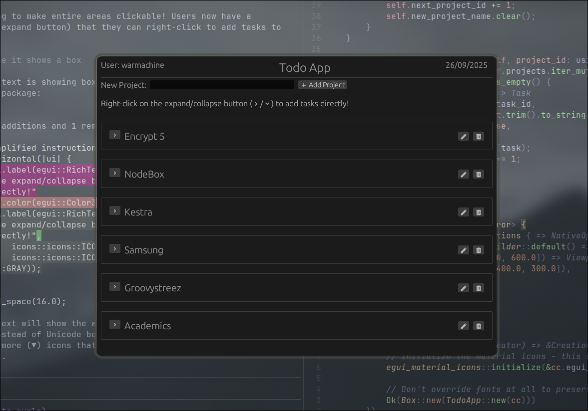
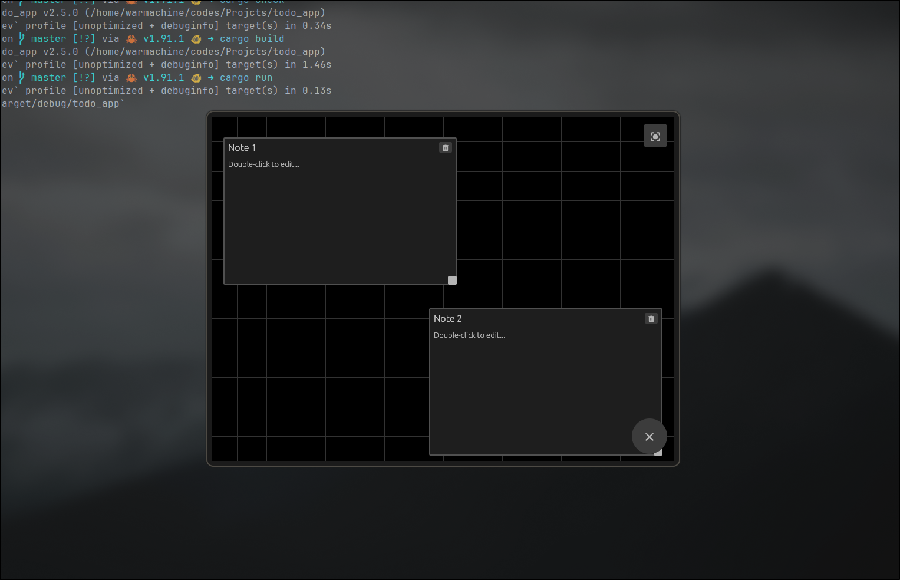

<h1 align="center" style="color:red" > RUST::TODO<&APP> </h1>

---
<h4 align="center"> This is all your todo app should do. </h4>



 
## Installation & Usage

### Building and Installing
```bash
# Build the release binary
cargo build --release

# Install to user local bin (no sudo required)
mkdir -p ~/.local/bin
cp target/release/todo_app ~/.local/bin/
chmod +x ~/.local/bin/todo_app
```

Make sure `~/.local/bin` is in your PATH. If not, add this to your shell profile:
```bash
export PATH="$HOME/.local/bin:$PATH"
```

### Hyprland Integration
The binary is configured in Hyprland with the following setup:

**Keybind:** `$mainMod SHIFT + T` - Launch TODO App
```conf
bind = $mainMod SHIFT, T, exec, todo_app # Launch TODO App
```

**Window Rules:**
```conf
windowrule = center,^(todo_app)$ # TODO App (fallback)
windowrulev2 = float, class:^(todo_app)$ # TODO App (fallback)
windowrulev2 = size 800 600, class:^(todo_app)$ # TODO App (fallback)
```

The app will open as a floating window, centered on screen with dimensions 800x600.
